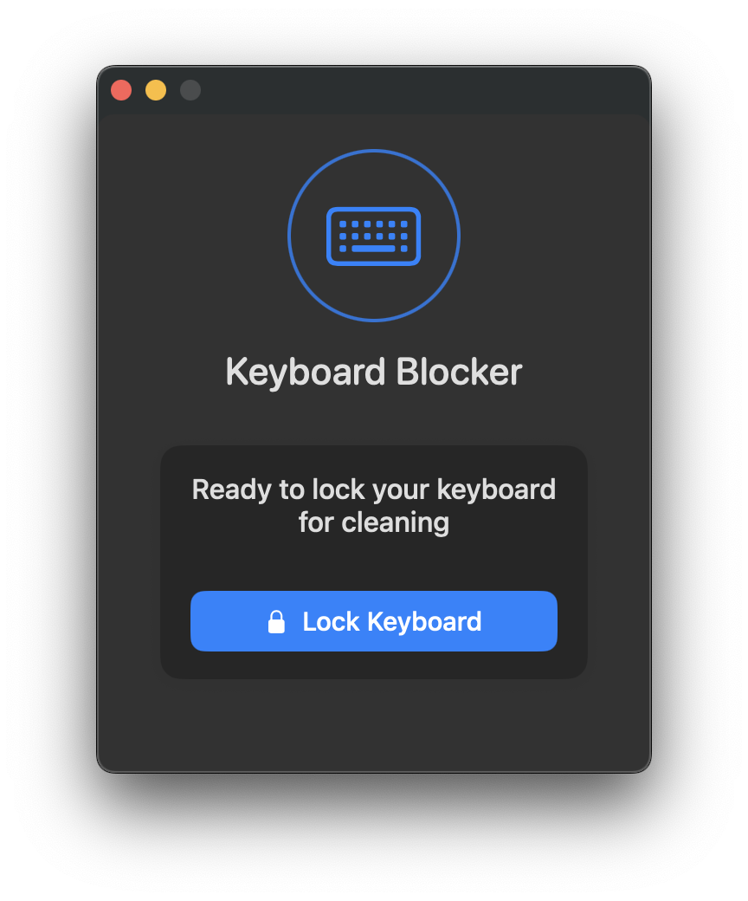

# KeyboardBlocker - macOS Keyboard Locking Utility

[](LICENSE)
[](https://www.apple.com/macos)
[](https://swift.org)
[](CHANGELOG.md)

A lightweight macOS utility that temporarily locks your keyboard for cleaning. Prevents accidental key presses while cleaning your MacBook, Magic Keyboard, or any external keyboard connected to your Mac.



## What’s new in 1.1.0

- **Menu bar tool** — Runs from the menu bar (LSUIElement: no Dock icon). Open the popover from the keyboard icon.
- **Minimal animated icon** — Subtle animation while the keyboard is locked.
- **Launch at login** — Optional toggle on macOS 13+ (System Settings integration via `SMAppService`).
- **Popover stays open when locked** — You can read unlock instructions without the window disappearing.
- **Safer while locked** — Quit, “Start at login”, and ⌘Q are disabled until you unlock (hold **ESC for 3 seconds**).

See [CHANGELOG.md](CHANGELOG.md) for full release notes.

## Key features

- **Complete keyboard blocking**: Clean your Mac keyboard without triggering unwanted actions
- **Multi-display support**: Dimmed overlay across all connected screens
- **Unlock with ESC**: Hold the **ESC** key for **3 seconds** to unlock
- **Menu bar UI**: Popover controls; right-click the icon for Open / Quit
- **Launch at login** (macOS 13+): Enable from the popover; older macOS: add the app under System Settings → General → Login Items
- **Privacy focused**: Zero data collection; runs entirely on your Mac
- **Energy efficient**: Minimal CPU and memory usage
- **Universal binary**: Apple Silicon and Intel

## Installation

### Download pre-built app

1. Open [Releases](https://github.com/huseyinaslim/macos-keyboardblocker/releases)
2. Download the latest `KeyboardBlocker.app.zip` (or attached build for **v1.1.0**)
3. Unzip and move **KeyboardBlocker.app** to **Applications**
4. First launch: Control-click the app → **Open** to pass Gatekeeper if needed

### Build from source

```bash
git clone https://github.com/huseyinaslim/macos-keyboardblocker.git
cd macos-keyboardblocker
swift build -c release
```

Binary: `.build/release/KeyboardBlocker`

For a signed `.app` bundle with entitlements (e.g. launch at login), use Xcode and enable the **Login Items** capability to match `KeyboardBlocker.entitlements`.

## Usage

1. Launch **KeyboardBlocker** — the icon appears in the **menu bar**
2. Click the icon to open the popover
3. Grant **Input Monitoring** (and Accessibility if prompted) when asked
4. Tap **Lock Keyboard** when you want to clean
5. When finished, **hold ESC for 3 seconds** to unlock
6. **Right-click** the menu bar icon for **Open** or **Quit**

While locked, Quit and “Start at login” are intentionally disabled so you don’t exit or change startup settings by accident.

## Privacy and security

KeyboardBlocker does not collect or transmit data. Input monitoring is used only to intercept keyboard events while the lock is active.

## System requirements

- macOS 11 (Big Sur) or later (launch-at-login toggle requires **macOS 13+**)
- Apple Silicon or Intel
- Small disk footprint (&lt; 5 MB)

## Contributing

- [Issues](https://github.com/huseyinaslim/macos-keyboardblocker/issues) — bugs and ideas
- [Pull requests](https://github.com/huseyinaslim/macos-keyboardblocker/pulls) — improvements

## License

MIT — see [LICENSE](LICENSE).

## Sponsor

If KeyboardBlocker is useful to you, consider [sponsoring on GitHub](https://github.com/sponsors/huseyinaslim).

## Keywords

macOS keyboard cleaner, MacBook keyboard lock, keyboard cleaning utility, menu bar utility, launch at login, keyboard blocker, Mac keyboard cleaning tool
